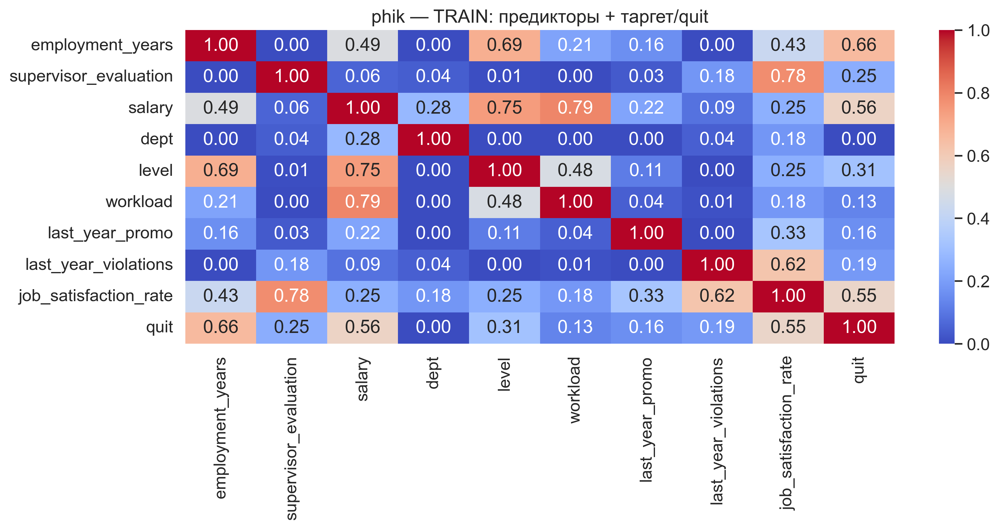
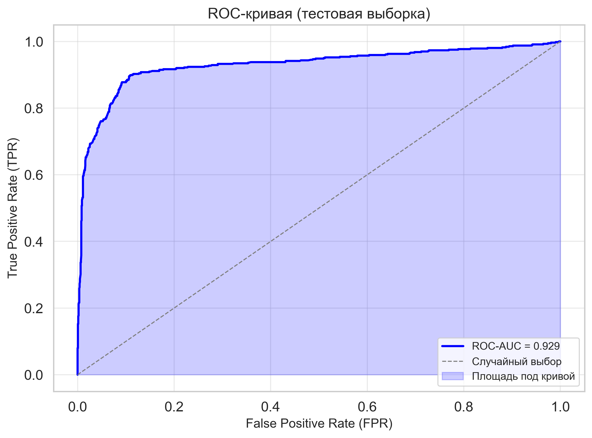
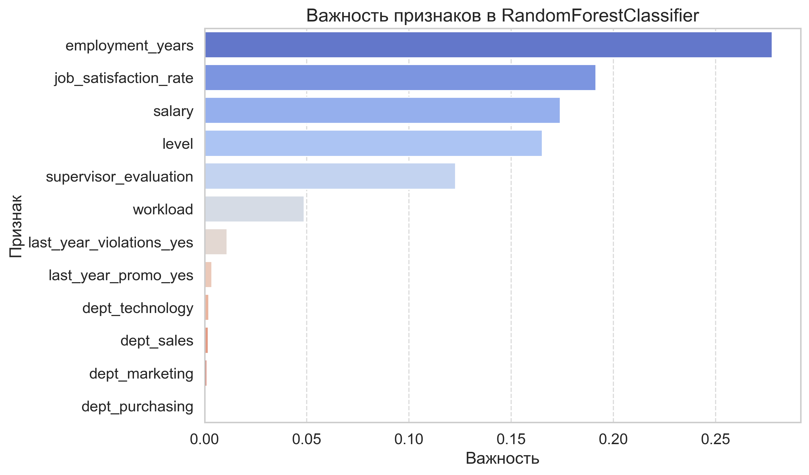

# 👥 HR-аналитика: удовлетворённость и отток сотрудников

ML-проект из двух связанных задач: **регрессия** (прогноз уровня удовлетворённости сотрудника) и **классификация** (прогноз увольнения), где предсказания первой модели используются как признак во второй.

**Результат: обе модели превысили целевые пороги — SMAPE = 13.8 (порог ≤ 15) и ROC-AUC = 0.93 (порог ≥ 0.91).**

## 📋 Задача

HR-отделу компании нужно заранее выявлять сотрудников с высоким риском ухода, чтобы принимать превентивные меры и снижать текучесть кадров. Для этого строятся две модели: первая оценивает уровень удовлетворённости работой (его сложно и дорого измерять опросами), вторая — используя в том числе этот прогноз — предсказывает вероятность увольнения.

## 📊 Данные

Данные компании о сотрудниках: должностной уровень, стаж, зарплата, загруженность, оценка руководителя, нарушения контракта, продвижения — и целевые переменные (удовлетворённость, факт увольнения). Предобработка и кодирование собраны в **sklearn-пайплайны** (OrdinalEncoder, OneHotEncoder, масштабирование).

Корреляционный анализ выполнен через **phik** — в отличие от корреляции Пирсона,
он корректно работает с категориальными признаками и улавливает нелинейные связи,
что критично для HR-данных, где большинство признаков категориальные.
Сильнейшая связь с целевой переменной — у оценки руководителя (phik = 0.78):
удовлетворённость сотрудника во многом формируется отношениями с руководством.



## 🧪 Задача 1. Регрессия: удовлетворённость (SMAPE ≤ 15)

Сравнение моделей по SMAPE на кросс-валидации (GridSearchCV); на тесте оценивалась только лучшая:

| Модель | SMAPE |
| --- | --- |
| **DecisionTreeRegressor (test)** | **13.8** |
| Ridge (CV) | 27.9 |
| DummyRegressor, baseline (test) | 38.3 |

Критерий выполнен, модель кратно превосходит константный бейзлайн.

## 🧠 Задача 2. Классификация: увольнение (ROC-AUC ≥ 0.91)

Подбор гиперпараметров для нескольких классификаторов по ROC-AUC (RandomizedSearchCV):

| Модель | ROC-AUC (test) |
| --- | --- |
| **RandomForestClassifier** | **0.929** (CV: 0.938) |
| Dummy (most frequent / stratified) | 0.50 |



Наибольший вклад в прогноз увольнения: должностной уровень, стаж, **предсказанная удовлетворённость**, зарплата и взаимодействие «нагрузка × оценка руководителя».



## 💼 Выводы для бизнеса

- Около **80% уволившихся** — сотрудники уровня junior со стажем до трёх лет → нужны программы адаптации и наставничества;
- Почти все уволившиеся **не получали повышения за последний год** → требуется прозрачная система карьерного роста;
- Зарплаты оставшихся в среднем **на 50–60% выше**, чем у уволившихся;
- Наибольший отток — в отделах sales и technology → приоритет для опросов и улучшения условий;
- Связка двух моделей работает как единый HR-инструмент: оцениваем удовлетворённость → прогнозируем риск ухода → действуем проактивно.

## 🛠 Стек

`Python` · `pandas` · `NumPy` · `scikit-learn` · `phik` · `Matplotlib` · `Seaborn` · `Jupyter`

## 🚀 Как запустить

```bash
git clone https://github.com/foxypandas/hr-ml-analysis.git
cd hr-ml-analysis
pip install -r requirements.txt
jupyter notebook notebooks/hr_ml_analysis_ru.ipynb
```

Датасет в репозиторий не включён 

## 📁 Структура проекта

```
├── notebooks/     # основной ноутбук
├── images/        # графики
└── requirements.txt
```
